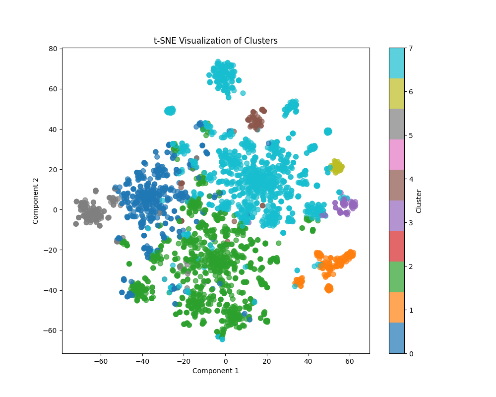

# 🚀 OpenStack Code Review Analysis

## 📜 **Problem Statement**

The objective of this project is to **automate and optimize** the code review process in OpenStack repositories by:

1. 🧩 **Clustering code check-ins** based on architectural attributes like documentation, performance, and security.
2. 🤖 Exploring **machine learning techniques** to auto-evaluate check-ins.
3. 🔍 **Analyzing security-related check-ins** to understand their interaction with other architectural attributes.

---

## 💻 **Tech Stack**

- **Languages**: Python 🐍
- **Libraries**:
  - pandas 📊, numpy 🔢
  - scikit-learn 🤖
  - matplotlib 📈, seaborn 🌊
  - nltk 📝 (Natural Language Toolkit)
- **Tools**:
  - Docker 🐳 for environment isolation
  - Git 🌟 for version control

---

## 🛠️ **Solution**

The project is divided into three phases:

### **P1: Code Check-in Clustering** 🧩

- ✅ **Clustering**: Used K-Means clustering on TF-IDF vectorized text features to group check-ins.
- ✅ **Insights**: Identified key terms and cluster distributions to assign architectural attributes.
- ✅ **Validation**: Generated 2D visualizations to validate the clusters.

### **P2: Machine Learning Assistance** 🤖

- ✅ **Labeling**: Labeled clusters with architectural attributes (e.g., documentation, security).
- ✅ **Model Training**: Trained a machine learning model to classify check-ins into attributes.
- ✅ **Evaluation**: Verified the model's performance using metrics like precision, recall, and F1-score.

### **P3: Security Check-in Analysis** 🔒

- ✅ **Attribute Interaction**: Analyzed how security-related check-ins interact with documentation, performance, and modifiability.
- ✅ **Insights**: Identified overlaps and gaps in security-related reviews.
- ✅ **Recommendations**: Suggested actionable improvements for OpenStack’s security processes.

---

## 🏗️ **Running the Project**

### **Prerequisites**

1. Install [Docker](https://www.docker.com/) 🐳.
2. Clone this repository:
   ```bash
   git clone https://github.com/<your-username>/OpenStack-Code-Review-Analysis.git
   cd OpenStack-Code-Review-Analysis
   ```

---

### **P1: Code Check-in Clustering** 🧩

#### Step 1: Preprocess the data

- This step cleans and prepares the input dataset.
  ```bash
  docker run --rm -v $(pwd):/app -w /app code-review-analysis python data_cleaning.py
  ```

#### Step 2: Apply clustering

- Clusters the cleaned data based on architectural attributes.
  ```bash
  docker run --rm -v $(pwd):/app -w /app code-review-analysis python kmeans_clustering.py
  ```

#### Step 3: Validate the clusters

- Generates 2D visualizations of the clusters.
  ```bash
  docker run --rm -v $(pwd):/app -w /app code-review-analysis python generate_2d_visualization.py
  ```

---

### **P2: Machine Learning Assistance** 🤖

#### Step 1: Label the clusters

- Assigns labels (documentation, security, performance) to each cluster.
  ```bash
  docker run --rm -v $(pwd):/app -w /app code-review-analysis python label_clusters.py
  ```

#### Step 2: Train the model

- Trains a machine learning model to classify new check-ins.
  ```bash
  docker run --rm -v $(pwd):/app -w /app code-review-analysis python train_classifier.py
  ```

#### Step 3: Test auto-evaluation

- Predicts architectural attributes for new check-ins.
  ```bash
  docker run --rm -v $(pwd):/app -w /app code-review-analysis python auto_evaluate.py
  ```

#### Step 4: Validate predictions

- Verifies the quality of predictions by checking distribution and samples.
  ```bash
  docker run --rm -v $(pwd):/app -w /app code-review-analysis python validate_predictions.py
  ```

---

### **P3: Security Check-in Analysis** 🔒

#### Step 1: Clean security data

- Preprocesses the dataset of security-related reviews.
  ```bash
  docker run --rm -v $(pwd):/app -w /app code-review-analysis python security_data_cleaning.py
  ```

#### Step 2: Analyze clusters

- Identifies and documents clusters of security-related reviews.
  ```bash
  docker run --rm -v $(pwd):/app -w /app code-review-analysis python analyze_security_clusters.py
  ```

#### Step 3: Attribute interaction

- Analyzes the interaction of security-related reviews with other attributes.
  ```bash
  docker run --rm -v $(pwd):/app -w /app code-review-analysis python analyze_attribute_interactions.py
  ```

#### Step 4: Extract interaction examples

- Extracts review examples for each attribute.
  ```bash
  docker run --rm -v $(pwd):/app -w /app code-review-analysis python extract_interaction_examples.py
  ```

#### Step 5: Attribute interaction statistics

- Summarizes interactions and generates insights.
  ```bash
  docker run --rm -v $(pwd):/app -w /app code-review-analysis python attribute_interaction_statistics.py
  ```

---

## 📂 **Project Outputs**

- 📄 **Labeled Clusters**: `labeled_data.csv`
- 🤖 **Machine Learning Model**: `classifier_model.pkl`
- 🔍 **Security Insights**: Cluster-specific and interaction statistics.
- 📊 **Visualizations**: 2D cluster plots.

---

## 🤝 **Contributing**

Feel free to fork this repository and contribute by creating a pull request. 🎉

---

## 🙌 **Acknowledgements**

- OpenStack community for the dataset 🌐.
- [OpenAI ChatGPT](https://openai.com/) for project assistance 🤖.

---

## 📸 **Screenshots and Visuals**

- Example Cluster Visualization:
  

- 2D t-SNE Plot:
  

---
